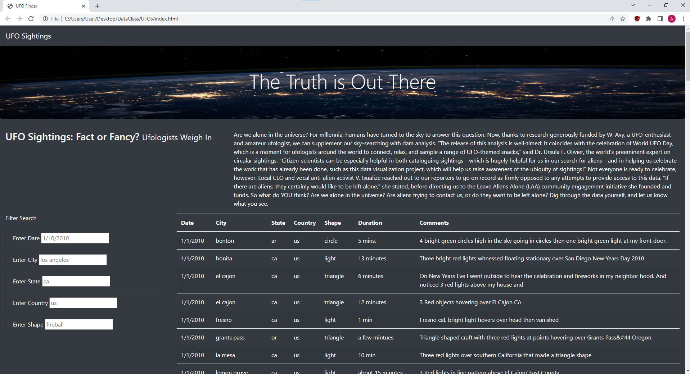
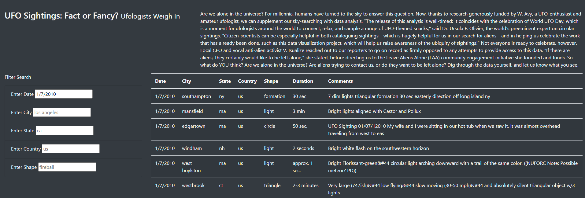
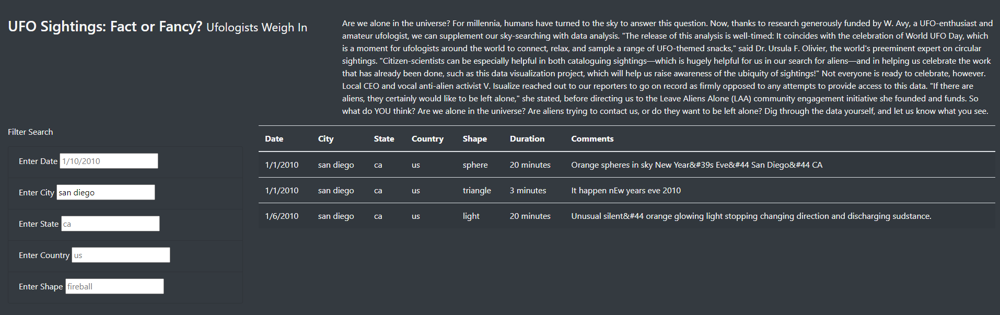
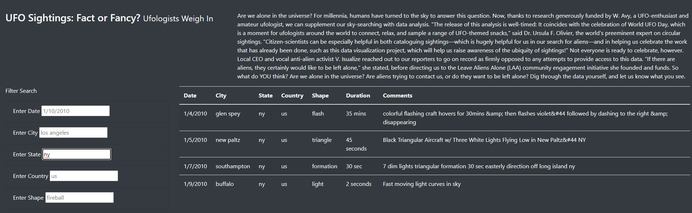
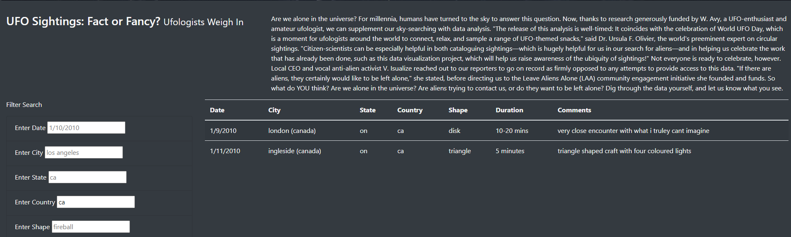
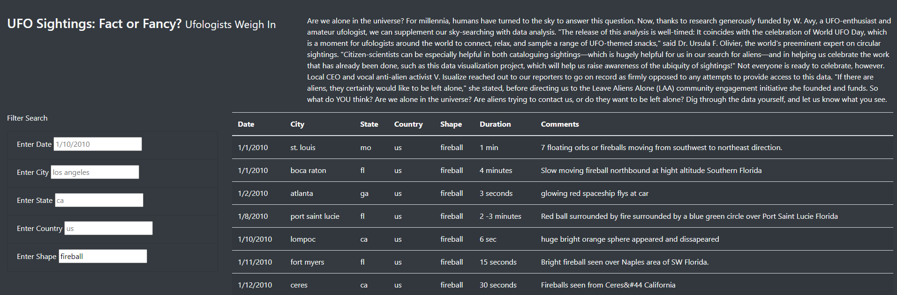
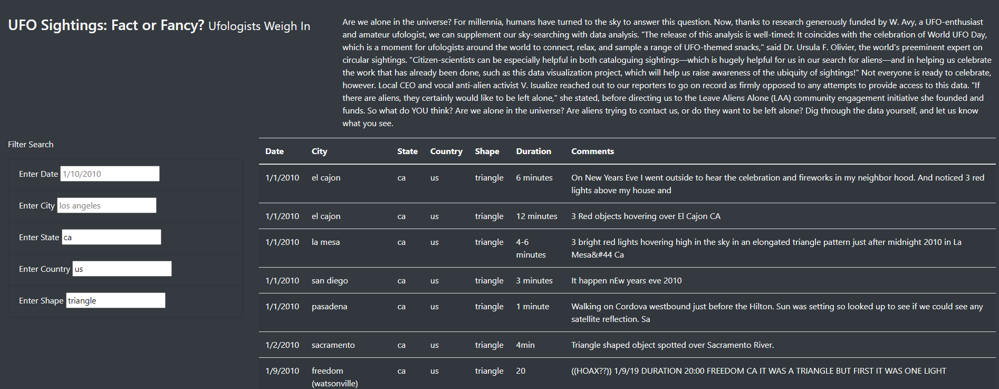

# UFOs

## Analysis
### Overview
The purpose of this project was to create a webpage with filtering capabilites to store and view UFO sighting data. This project used HTML, Javascript, Bootstrap, & CSS.

### Results
There are 5 filters to choose from: Date, City, State, Country, and Shape. One can use a single filter or mutliple to change the view of the data table.

- Homepage (unfiltered)
  - 

Below are some examples of filter use:
- Date
  - 
- City
  - 
- State
  - 
- Country
  - 
- Shape
  - 
- Multiple filters
  - 

### Summary
- Summary addresses one drawback of this webpage
- Summary addresses two additional recommendations for further development
